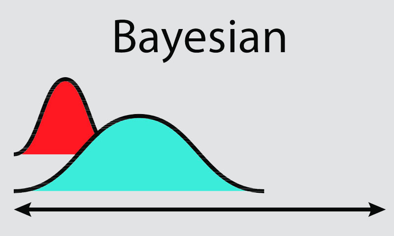
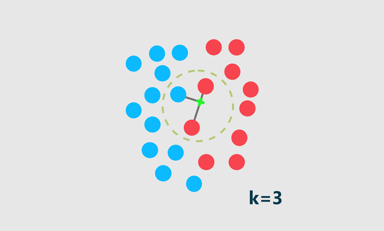
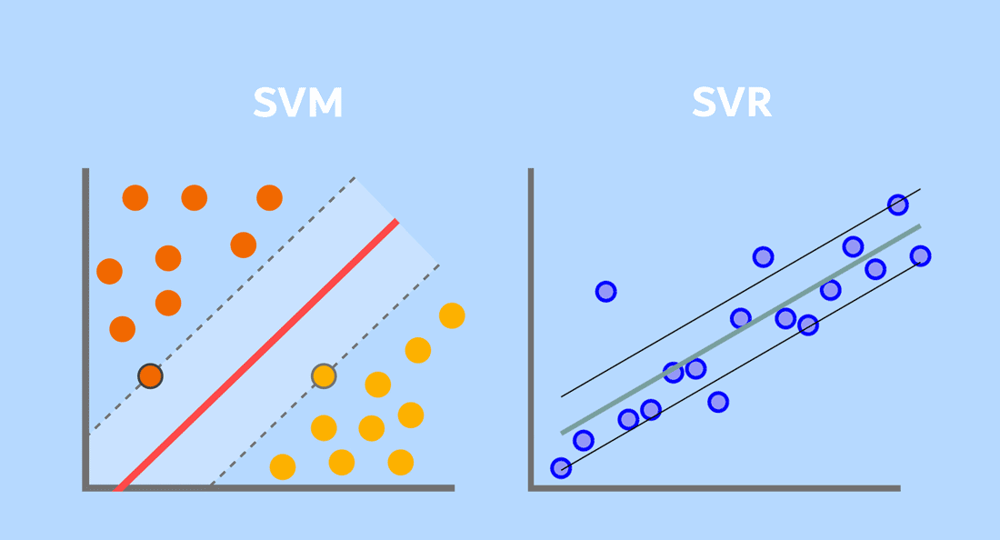
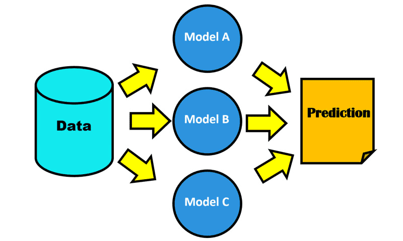
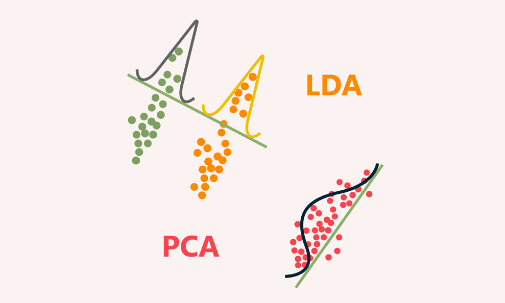
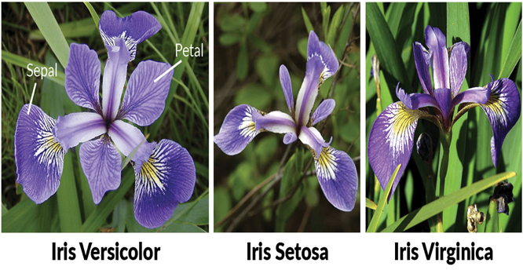
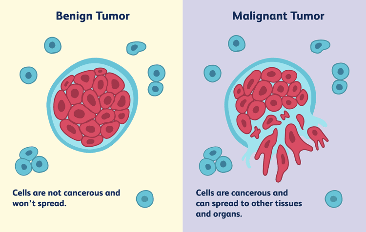
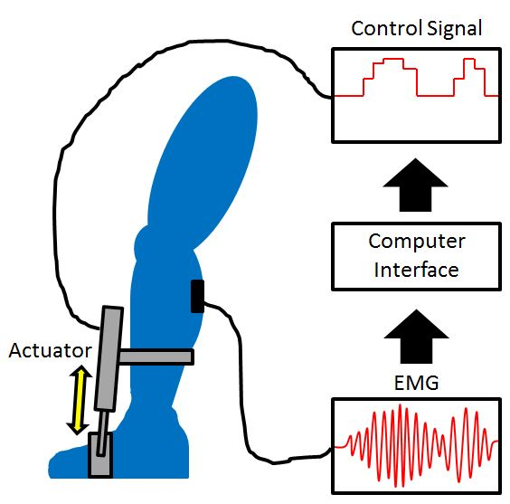
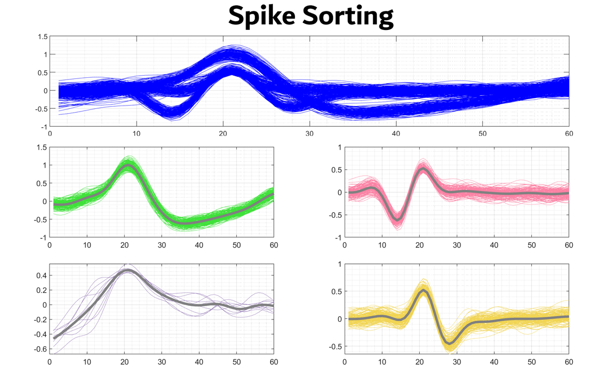

# Machine Learning & Pattern Recognition from Scratch (MATLAB)

**Author:** Mohammad Norizadeh Cherloo  
Educator & Researcher in Machine Learning, Deep Learning, Neural Decoding, Biomedical Signal Processing, and Brain-Computer Interfaces

---

### About This Repository

This repository contains **complete from-scratch implementations** of classical Machine Learning and Pattern Recognition algorithms in MATLAB.  

Every algorithm was first derived mathematically and then implemented manually (without relying on black-box functions). These codes are the result of years of teaching comprehensive courses on Pattern Recognition and Machine Learning.

- **20 algorithms** implemented from scratch  
- **16+ practical projects** included

---

### Table of Contents

- [1. Classification and Regression](https://github.com/Mohammad-Norizadeh-Cherloo/Machine-Learning-From-Scratch/tree/main/1-%20Classification%20and%20Regression)
  - [Parametric Classifiers (Naive Bayes)](https://github.com/Mohammad-Norizadeh-Cherloo/Machine-Learning-From-Scratch/tree/main/1-%20Classification%20and%20Regression/1-Parametric-Classifiers-Naive%20Baysian)
  - [KNN and Weighted KNN](https://github.com/Mohammad-Norizadeh-Cherloo/Machine-Learning-From-Scratch/tree/main/1-%20Classification%20and%20Regression/2-KNN-and-Weighted-KNN)
  - [SVM and SVR](https://github.com/Mohammad-Norizadeh-Cherloo/Machine-Learning-From-Scratch/tree/main/1-%20Classification%20and%20Regression/3-%20SVM%20and%20SVR)
- [2. Ensemble Learning](https://github.com/Mohammad-Norizadeh-Cherloo/Machine-Learning-From-Scratch/tree/main/2-%20Ensemble%20Learning)
  - [Voting](https://github.com/Mohammad-Norizadeh-Cherloo/Machine-Learning-From-Scratch/tree/main/2-%20Ensemble%20Learning/1-%20Voting)
  - [Stacking](https://github.com/Mohammad-Norizadeh-Cherloo/Machine-Learning-From-Scratch/tree/main/2-%20Ensemble%20Learning/2-%20Stacking)
  - [AdaBoost](https://github.com/Mohammad-Norizadeh-Cherloo/Machine-Learning-From-Scratch/tree/main/2-%20Ensemble%20Learning/3-%20Ada-Boost)
  - [Bootstrap Bagging](https://github.com/Mohammad-Norizadeh-Cherloo/Machine-Learning-From-Scratch/tree/main/2-%20Ensemble%20Learning/4-%20Bootstrap-Bagging)
- [3. Dimensionality Reduction](https://github.com/Mohammad-Norizadeh-Cherloo/Machine-Learning-From-Scratch/tree/main/3-Dimention%20Reduction)
  - [PCA](https://github.com/Mohammad-Norizadeh-Cherloo/Machine-Learning-From-Scratch/tree/main/3-Dimention%20Reduction/1-%20PCA)
  - [LDA](https://github.com/Mohammad-Norizadeh-Cherloo/Machine-Learning-From-Scratch/tree/main/3-Dimention%20Reduction/2-%20LDA)
- [4. Clustering](https://github.com/Mohammad-Norizadeh-Cherloo/Machine-Learning-From-Scratch/tree/main/4-Clustering)
  - [K-Means](https://github.com/Mohammad-Norizadeh-Cherloo/Machine-Learning-From-Scratch/tree/main/4-Clustering/1-Kmeans)
  - [Fuzzy C-Means (FCM)](https://github.com/Mohammad-Norizadeh-Cherloo/Machine-Learning-From-Scratch/tree/main/4-Clustering/2-FCM)
  - [G-Means](https://github.com/Mohammad-Norizadeh-Cherloo/Machine-Learning-From-Scratch/tree/main/4-Clustering/3-Gmeans)
- [Practical Projects Summary](#practical-projects-summary)
- [Full Video Courses](#full-video-courses)

---

### 1. Classification and Regression

**Main Folder:** [1- Classification and Regression](https://github.com/Mohammad-Norizadeh-Cherloo/Machine-Learning-From-Scratch/tree/main/1-%20Classification%20and%20Regression)

#### Parametric Classifiers

- Naive Bayes / Bayesian Classifier
- Maximum Likelihood
- Euclidean Distance
- Mahalanobis Distance

📁 [Go to folder](https://github.com/Mohammad-Norizadeh-Cherloo/Machine-Learning-From-Scratch/tree/main/1-%20Classification%20and%20Regression/1-Parametric-Classifiers-Naive%20Baysian)

#### K-Nearest Neighbors (KNN & Weighted KNN)

- KNN and Weighted KNN for Classification and Regression

📁 [Go to folder](https://github.com/Mohammad-Norizadeh-Cherloo/Machine-Learning-From-Scratch/tree/main/1-%20Classification%20and%20Regression/2-KNN-and-Weighted-KNN)

#### Support Vector Machines & SVR

- Binary SVM (Hard-Margin & Soft-Margin)
- Multi-class SVM (One-vs-One & One-vs-Rest)
- Support Vector Regression (SVR)

📁 [Go to folder](https://github.com/Mohammad-Norizadeh-Cherloo/Machine-Learning-From-Scratch/tree/main/1-%20Classification%20and%20Regression/3-%20SVM%20and%20SVR)

---

### 2. Ensemble Learning

**Main Folder:** [2- Ensemble Learning](https://github.com/Mohammad-Norizadeh-Cherloo/Machine-Learning-From-Scratch/tree/main/2-%20Ensemble%20Learning)

- [Voting](https://github.com/Mohammad-Norizadeh-Cherloo/Machine-Learning-From-Scratch/tree/main/2-%20Ensemble%20Learning/1-%20Voting)
- [Stacking](https://github.com/Mohammad-Norizadeh-Cherloo/Machine-Learning-From-Scratch/tree/main/2-%20Ensemble%20Learning/2-%20Stacking)
- [AdaBoost](https://github.com/Mohammad-Norizadeh-Cherloo/Machine-Learning-From-Scratch/tree/main/2-%20Ensemble%20Learning/3-%20Ada-Boost)
- [Bootstrap Bagging](https://github.com/Mohammad-Norizadeh-Cherloo/Machine-Learning-From-Scratch/tree/main/2-%20Ensemble%20Learning/4-%20Bootstrap-Bagging)

---

### 3. Dimensionality Reduction

**Main Folder:** [3- Dimensionality Reduction](https://github.com/Mohammad-Norizadeh-Cherloo/Machine-Learning-From-Scratch/tree/main/3-Dimention%20Reduction)

- [PCA](https://github.com/Mohammad-Norizadeh-Cherloo/Machine-Learning-From-Scratch/tree/main/3-Dimention%20Reduction/1-%20PCA)
- [LDA (Fisher Discriminant Analysis)](https://github.com/Mohammad-Norizadeh-Cherloo/Machine-Learning-From-Scratch/tree/main/3-Dimention%20Reduction/2-%20LDA)

---

### 4. Clustering

**Main Folder:** [4- Clustering](https://github.com/Mohammad-Norizadeh-Cherloo/Machine-Learning-From-Scratch/tree/main/4-Clustering)

- [K-Means](https://github.com/Mohammad-Norizadeh-Cherloo/Machine-Learning-From-Scratch/tree/main/4-Clustering/1-Kmeans)
- [Fuzzy C-Means (FCM)](https://github.com/Mohammad-Norizadeh-Cherloo/Machine-Learning-From-Scratch/tree/main/4-Clustering/2-FCM)
- [G-Means](https://github.com/Mohammad-Norizadeh-Cherloo/Machine-Learning-From-Scratch/tree/main/4-Clustering/3-Gmeans)

---

### Practical Projects Summary

Here are the main practical projects included in this repository:

---

#### 1. Iris Flower Classification

**Algorithms used:** Parametric Classifiers, KNN, Weighted KNN, SVM, Ensemble methods

---

#### 2. Breast Cancer Classification (UCI Dataset)

**Algorithms used:** Binary SVM, Stacking Ensemble

---

#### 3. Air Quality Prediction (UCI Dataset)

**Algorithms used:** KNN / Weighted KNN Regression, Support Vector Regression (SVR)

---

#### 4. Ankle Joint Angle Estimation from sEMG

**Algorithms used:** Support Vector Regression (SVR)

---

#### 5. Neural Spike Sorting

**Algorithms used:** K-Means, Fuzzy C-Means, G-Means + PCA

---

#### 6. Medical Image Tumor Extraction

**Algorithms used:** K-Means, Fuzzy C-Means
---

### Full Video Courses

All mathematical derivations, whiteboard explanations, and step-by-step coding sessions are available here:

**→ [OnlineBME – Machine Learning & Pattern Recognition Courses](https://onlinebme.com/product-category/machine-learning)**

---

### Contact

- Website: [https://onlinebme.com](https://onlinebme.com)  
- Google Scholar: [Mohammad Norizadeh Cherloo](https://scholar.google.com/citations?user=fIKpYm8AAAAJ)  
- GitHub: [Mohammad-Norizadeh-Cherloo](https://github.com/Mohammad-Norizadeh-Cherloo)

---

> **“An old man once told me if you want to drive more easily in a city, first walk through that city on foot.”**
>
> The same is true in Artificial Intelligence. If you want to use or improve algorithms more effectively, first implement them from scratch. Only then will you gain a deeper understanding of the algorithm and the problem it solves.
>
> — Mohammad Norizadeh Cherloo
